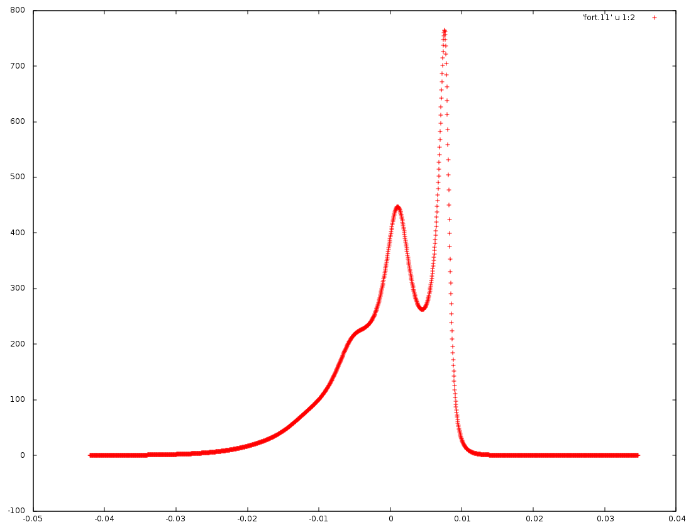

# Linshape-Study

## Overview

This project is programmed by C and Fortran to investigate the quantum dynamics of charge hopping kernel in one-dimensional chain. Some  is modeled to test the results.